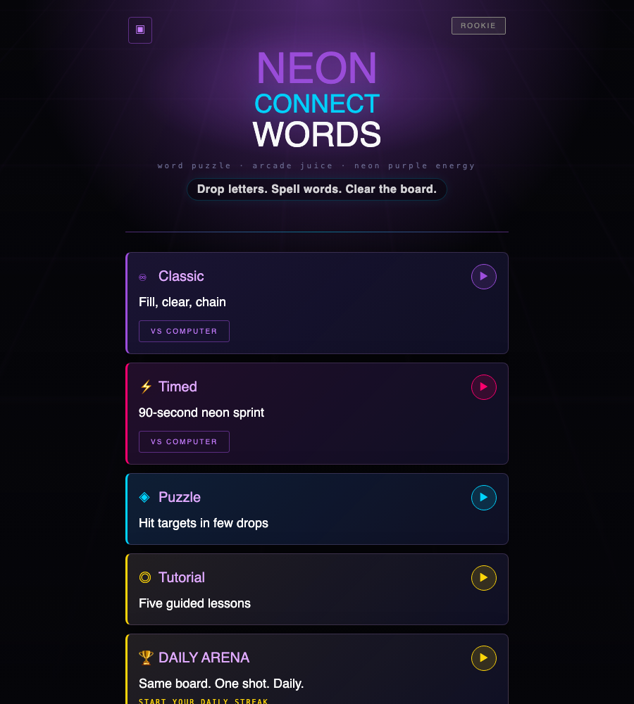
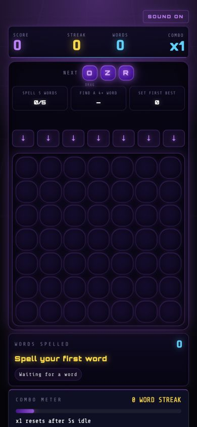

# Neon Connect Words

Mobile-first arcade word game built with React and Tailwind CSS.

Drop letter tiles into a gravity board, spell words, trigger combo chains, and keep the board alive with neon arcade feedback.

## Screenshots

### Home



### Game Board



## Run Locally

```bash
npm install
npm run dev -- --port 5174
```

Then open:

```text
http://127.0.0.1:5174/
```
